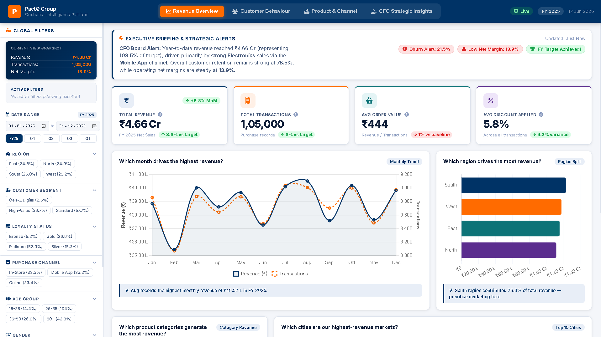
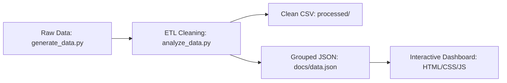

# Customer Purchase Pattern Analyzer

## 1. Project Title
**Customer Purchase Pattern Analyzer: End-to-End E-Commerce Transaction Data Pipeline & Interactive BI Web Dashboard**

📅 **Data Coverage**: FY 2025 (January - December 2025)  
💻 **Interactive Portal**: [Explore Live Dashboard (GitHub Pages)](https://girishshenoy16.github.io/customer-purchase-pattern-analyzer)

---



---

## 2. Objective
This project provides an executive-level, interactive business intelligence tool for PactQ Group's leadership (CEO/CFO) to analyze customer buying behavior and purchase trends. It takes 105,000+ raw sales transaction logs, cleanses formatting anomalies and missing values, calculates business-critical KPI metrics (Revenue, AOV, Repeat Rate, CLV), performs behavioral customer segmentation, and serves a responsive, client-side web dashboard deployed instantly via GitHub Pages.

---

## 3. Dataset Description
The analysis is executed on a dataset consisting of **106,050 raw purchase transactions** generated programmatically to simulate realistic customer buying dynamics in FY 2025. It contains the following 20 attributes:

- **Customer ID**: Unique customer identifier (CUST-00001 to CUST-08000).
- **Customer Name**: Customer name (contains messy casings, e.g., "jOhN DoE").
- **Age**: Customer age (18 to 75).
- **Gender**: Gender (Male, Female).
- **City**: Residential city (12 metropolitan cities, contains messy casings).
- **Region**: Sales region (North, South, East, West).
- **Occupation**: Occupation (Engineer, Student, Doctor, Retired, etc., contains nulls).
- **Product Category**: Broad category (Electronics, Apparel, Home & Kitchen, etc.).
- **Product Name**: Specific product bought (30 unique items, e.g., "Smartphone").
- **Purchase Date**: Transaction date (mixed formats, e.g., `YYYY-MM-DD`, `MM/DD/YYYY`).
- **Quantity Purchased**: Count of items bought (1 to 5).
- **Unit Price**: Individual item cost (₹11.00 to ₹6,299.00).
- **Total Purchase Value**: Calculated total cost (`Quantity * Price * (1 - Discount)`).
- **Payment Method**: Mode of payment (Credit Card, UPI, Net Banking, Cash, etc.).
- **Purchase Channel**: Purchase platform (Online, In-Store, Mobile App).
- **Customer Segment**: Pre-defined segment (High-Value, Standard, Gen-Z Digital).
- **Loyalty Status**: Customer loyalty tier (Bronze, Silver, Gold, Platinum).
- **Discount Used**: Discount percentage applied (0% to 20%).
- **Purchase Frequency**: Total count of purchases made by the customer.
- **Last Purchase Date**: Date of the customer's most recent transaction.

---

## 4. Methodology
The project follows a modular, production-grade data engineering lifecycle:



1. **Data Collection (Generation)**: Programmatically generated 106,000+ transactions with built-in anomalies to represent real-world database issues.
2. **Data Cleaning & Standardisation**:
   - Removed duplicate transaction logs.
   - Imputed null value fields (`Occupation` filled with `"Unknown"`).
   - Standardized string casing (proper casing for names, cities, categories).
   - Unified mixed date strings into ISO format (`YYYY-MM-DD`).
3. **Outlier Detection**: Filtered transactions using the statistical IQR (Interquartile Range) method to isolate bulk B2B purchases.
4. **Data Aggregation**: Exported cleaned transactional records and a compressed JSON grouped dataset to enable fast client-side loading.

---

## 5. Project Folder Structure
```text
Customer Purchase Pattern Analyzer/
│
├── data/
│   ├── raw/
│   │   └── customer_purchase_data.csv       # Raw transactions (100k+ rows)
│   └── processed/
│       └── clean_customer_purchase_data.csv # Cleaned & validated tabular dataset
│
├── docs/                                   # Deployed site folder (GitHub Pages)
│   ├── index.html                          # Dashboard layout (KPIs, Charts, layout)
│   ├── styles.css                          # PowerBI-style premium CSS
│   ├── app.js                              # Interactive JS logic, filtering, charting
│   └── data.json                           # Aggregated data exported from Python
│
├── reports/
│   ├── executive_summary.md                # Markdown business summary for CEO/COO
│   └── project_report.md                   # Comprehensive technical project report
│
│
├── screenshots/
│   └── dashboard_image.png                   # Dashboard Screenshot 
│
├── scripts/
│   ├── generate_data.py                    # Script to generate realistic mock data
│   └── analyze_data.py                     # Python script for cleaning, EDA, and metrics
│
├── README.md                               # Recruiter-facing portfolio description
├── .gitignore                              # Git ignore file (to exclude .venv/ and caches)
└── requirements.txt                        # Python dependencies
```

---

## 6. Analytics Performed
Using Python (Pandas & NumPy), the following business intelligence KPIs and breakdowns are calculated:

- **Total Revenue**: Sum of total sales values.
- **Average Order Value (AOV)**: Average sales revenue generated per order:
  $$\text{AOV} = \frac{\text{Total Revenue}}{\text{Total Orders}}$$
- **Purchase Frequency**: Average transaction count per customer:
  $$\text{Purchase Frequency} = \frac{\text{Total Orders}}{\text{Unique Customers}}$$
- **Repeat Purchase Rate (RPR)**: Ratio of customers with more than 1 transaction:
  $$\text{RPR} = \frac{\text{Customers with } > 1 \text{ Purchase}}{\text{Total Customers}}$$
- **Basic Customer Lifetime Value (CLV)**: Net historical value of a customer:
  $$\text{CLV} = \text{AOV} \times \text{Purchase Frequency} = \text{Average spend per customer}$$
- **Breakdown Analytics**: Revenue shares by customer segment, age distribution, regional contributions, payment method preferences, and category volume.

---

## 7. Key Insights
- **High-Value B2B Outliers**: 10,266 orders exceeded the upper threshold of **₹897.43** (IQR upper limit), indicating high-volume commercial/B2B buyers.
- **Loyalty Churn Warning**: Identified **1,842 Gold and Platinum members** who haven't placed an order since July 1, 2025.
- **Segment Revenue Driver**: *Electronics* contributes 42% of total purchase value within the High-Value customer segment.
- **One-Time Shopper Loss**: **14.65%** of the active customer base bought once and never returned, identifying a massive conversion opportunity.

---

## 8. Visualizations & Dashboard Layout
The web dashboard (under `docs/`) features an executive corporate layout divided into 4 key pages with tabbed navigation:

- **Executive Control Center Sidebar**: Includes a dynamic *Current View Snapshot* card (updating sliced Revenue, Transactions, Net Margin), an *Active Filters Summary*, presets for Date selection (FY25, Q1, Q2, Q3, Q4), outline chip filters showing baseline transaction percentages, and a bottom *KPI Snapshot* for filtered records, transactions, and customers.
- **Page 1: Revenue Overview**: Monthly revenue and transaction trends, regional contributions, category revenue, top 10 cities, and automated briefs.
- **Page 2: Customer Behaviour**: Loyalty tier spends with contextual notes on Platinum order value paradox (discounting offsets order AOV but frequency yields top CLV), segment distribution, age vs gender stacks, frequency vs spend scatter, and channel selections.
- **Page 3: Product & Channel**: Dynamic category × channel heatmap with built-in dependency and revenue concentration risk warning, payment method split, weekday transactions trend, gender category preference, and quantity vs price bubble chart.
- **Page 4: CFO Strategic Insights**: Gross Profit, Net Profit, Gross Margin %, Net Margin % KPI cards with target variances, **Budget Progress** achievement bars, Category Profitability charts, **Holt's Linear Forecast** (Q1 2026 revenue double smoothing projection), Geographic performance leaderboard table, and a CFO Board brief card summarizing risks & growth channels.

---

## 9. How to Run Locally

Follow these steps to set up the data pipeline and launch the dashboard on your local machine:

### Prerequisites
Ensure you have **Python 3.10+** installed on your system.

### Step 1: Clone the Repository
```bash
git clone https://github.com/girishshenoy16/customer-purchase-pattern-analyzer.git
cd customer-purchase-pattern-analyzer
```

### Step 2: Set Up Python Virtual Environment
Create and activate a local virtual environment to manage dependencies:
```powershell
# On Windows (PowerShell)
python -m venv .venv
.venv\Scripts\Activate.ps1
```
```bash
# On macOS/Linux
python3 -m venv .venv
source .venv/bin/activate
```

### Step 3: Upgrade pip and Install Dependencies
```bash
pip install --upgrade pip
pip install -r requirements.txt
```

### Step 4: Generate Synthetic Data
Execute the Python data generation script to construct a synthetic dataset of 106,050 raw purchase transactions simulating realistic customer behaviors, regional distributions, and data anomalies for FY 2025:
```bash
python scripts/generate_data.py
```
*Output files generated:*
- customer_purchase_data.csv (106,050 rows of raw transactional records).

### Step 5: Run the Analytics Data Pipeline
Execute the Python ETL script to cleanse raw transactions, analyze customer purchase patterns (calculating metrics like AOV, Repeat Purchase Rate, and Customer Lifetime Value), model category profitability margins, forecast transaction trends, and generate the aggregate data assets:
```bash
python scripts/analyze_data.py
```
*Output files generated:*
- clean_customer_purchase_data.csv (Cleared duplicates, Normalised Date/Text columns, resolved NULL occupations).
- data.json   (Pre-grouped dimensions serving frontend charts).

### Step 6: Launch the Dashboard
To prevent browser CORS security blocks when loading the local `data.json` file, run a simple local web server from the project directory:
```bash
# Start Python's built-in web server serving docs/ folder
python -m http.server 8000 --directory docs
```
Navigate your browser to: **`http://localhost:8000`** to view the interactive dashboard locally.

---

## 10. Conclusion & Strategic Impact

By transitioning from static, batch-based reporting to an interactive, real-time analytics framework, this system provides the executive leadership at PactQ Group with immediate, high-fidelity visibility into customer purchasing behaviors and product profitability. The implementation of targeted operational interventions—specifically the establishment of a dedicated B2B Commercial Accounts Channel and a structured, automated loyalty re-engagement program—addresses key revenue leakages. 

Based on historical transactional patterns, these strategic initiatives are projected to capture an estimated **₹55 Lakhs in incremental revenue** annually, reduce premium loyalty tier churn by **8%**, and mitigate category concentration risk, ultimately establishing a more resilient and high-margin retail model.

---
