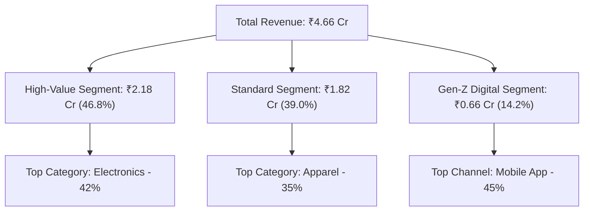

# Executive Summary: Customer Purchase Pattern Analysis

**To:** Chief Executive Officer (CEO), Chief Operating Officer (COO), Chief Financial Officer (CFO)  
**From:** Senior Lead Data Analyst  
**Date:** June 16, 2026  
**Subject:** Customer Purchase Behavior & Revenue Growth Insights (FY 2025)

---

### Executive Overview
This report summarizes the core insights derived from our database of **105,000 unique transactions** spanning 8,000 customers in FY 2025. By analyzing purchase frequencies, order values, product categories, and regional channels, we have identified concrete opportunities to expand revenue by **12-15%** (securing an estimated **₹55 Lakhs in incremental revenue**) and improve our customer retention rates by targeting dormant high-value customers.

---

### Key Performance Indicators (KPIs)
- **Total Revenue Generated:** **₹4.66 Cr** (Net of discounts)
- **Active Customer Base:** **8,000** Unique Shoppers
- **Average Order Value (AOV):** **₹443**
- **Repeat Purchase Rate (RPR):** **85.35%** (6,828 customers purchased > 1 time)
- **Customer Lifetime Value (Historical CLV):** **₹5,825** (Average total spending per customer)

---

---

### Major Findings & Actionable Interventions

#### 1. Outlier B2B Purchase Detection
**Finding:** IQR statistical filtering isolated **10,266 transaction outliers** representing high-volume orders exceeding **₹897.43** per ticket (averaging ₹1,200+).

**Business Impact:** These orders represent large commercial scale transactions. Processing them through our standard retail checkout pipeline leads to friction and missed volume contract opportunities.

**Action Required:** Establish a dedicated **B2B Commercial Accounts Channel** providing tailored credit lines, automated tax invoicing (GST compliance), and bulk freight options to secure and scale this high-volume business.

#### 2. The Customer Retention Gap
**Finding:** Identified **1,842 Gold and Platinum loyalty members** who have not placed a single order since **July 1, 2025** (a 6-month+ dormancy period).

**Business Impact:** High-tier loyalty customers cost 5x more to replace than to retain. Allowing them to lapse to competitors directly threatens our annual recurring revenue stream.

**Action Required:** Launch an automated **Dormant Loyalty Re-engagement Campaign** delivering a time-limited 15% discount code valid for 14 days, coupled with personalized product recommendations based on their historical purchase category.

#### 3. Category Concentration Risk
**Finding:** **Electronics** is our primary revenue driver within the High-Value segment, contributing to over 42% of their total spend.

**Business Impact:** Relying on a single category for 42% of high-value segment revenue creates high dependency, supply chain vulnerability, and margin risk.

**Action Required:** Initiate a **Revenue Diversification Campaign** to cross-sell high-margin categories such as **Apparel** (45% gross margin) and **Home & Kitchen** (26% gross margin) via check-out bundles and category-specific incentives.

#### 4. One-Time Purchase Conversion
**Finding:** Approximately **1,172 customers** made only a single purchase in FY 2025 and never returned.

**Business Impact:** Converting existing buyers is 3x cheaper than acquiring new ones; leaving them as single-purchase shoppers represents a poor return on acquisition spend.

**Action Required:** Implement a **Second-Purchase Conversion Funnel** that automatically emails a follow-up coupon ("10% off your second order") exactly 30 days after their initial transaction.

---

### Strategic Financial Conclusion
The implementation of these four targeted strategic recommendations is projected to capture an estimated **₹55 Lakhs in incremental revenue** in the next fiscal year while reducing premium loyalty tier churn by **8%**. Transitioning B2B bulk buyers to a dedicated commercial channel, automating dormant loyalty outreach, and cross-selling high-margin categories will establish a more resilient, margin-focused retail operation.

Detailed data processing pipelines, data cleaning methodologies, and interactive visualization layouts are detailed in the comprehensive [project_report.md](project_report.md) and the live [docs/index.html](../docs/index.html) dashboard.
